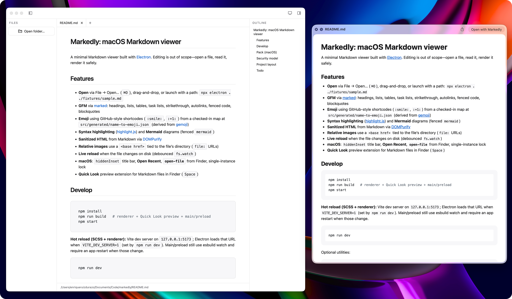

# Markedly: macOS Markdown viewer

A minimal Markdown viewer built with [Electron](https://www.electronjs.org/). Editing is out of scope—open a file, read it, render it safely.



## Features

- **Open** via File → Open… (`⌘O`), drag-and-drop, or launch with a path: `npx electron . ./fixtures/sample.md`
- **GFM** via [marked](https://marked.js.org/): headings, lists, tables, task lists, strikethrough, autolinks, fenced code, blockquotes
- **Emoji** using GitHub-style shortcodes (`:smile:`, `:+1:`) from a checked-in map at `src/generated/name-to-emoji.json` (derived from [gemoji](https://github.com/wooorm/gemoji))
- **Syntax highlighting** ([highlight.js](https://highlightjs.org/)) and **Mermaid** diagrams (fenced `mermaid`)
- **Sanitized HTML** from Markdown via [DOMPurify](https://github.com/cure53/DOMPurify)
- **Relative images** use a `<base href>` tied to the file’s directory (`file:` URLs)
- **Live reload** when the file changes on disk (debounced `fs.watch`)
- **macOS**: `hiddenInset` title bar, **Open Recent**, **`open-file`** from Finder, single-instance lock
- **Quick Look** preview extension for Markdown files in Finder (`Space`)

## Develop

```bash
npm install
npm run build   # renderer + Quick Look preview + main/preload
npm start
```

**Hot reload (SCSS + renderer):** Vite dev server on `127.0.0.1:5173`; Electron loads that URL when `VITE_DEV_SERVER=1` (set by `npm run dev`). Main/preload still use esbuild watch and require an app restart when those change.

```bash
npm run dev
```

Optional utilities:

```bash
npm run build:main       # main + preload only (dist/main, dist/preload)
npm run build:quicklook  # Quick Look preview only (dist/quicklook)
npm run build:renderer   # vite build only
```

Typecheck:

```bash
npm run typecheck
```

**Emoji map:** After bumping the `gemoji` dev dependency, or whenever you want the shortcode list aligned with upstream, regenerate the JSON the renderer and Quick Look import:

```bash
npm run generate:emoji
```

Commit the updated `src/generated/name-to-emoji.json` so installs and CI stay in sync without relying on a post-install step.

## Pack (macOS)

Requires Apple code signing/notarization for distribution outside your machine.

```bash
npm run pack
```

Output under `release/`. For Finder to discover the Quick Look extension, move the packaged app to `/Applications` and launch it once. If macOS keeps showing the plain text preview, disable competing Markdown Quick Look extensions in System Settings → Extensions → Quick Look.

## Security model

- `contextIsolation`, no Node in the renderer, **sandboxed** `BrowserWindow`
- Preload exposes a small IPC surface: open dialog, read file, file-changed / theme events
- External links open in the system browser; navigation in the window is not used for MD rendering

## Project layout

- `src/main` — menus, dialogs, file I/O, watcher, single-instance
- `src/preload` — `contextBridge` API
- `src/renderer` — Vite app: `index.html`, `main.ts`, SCSS, Markdown UI (dev: HMR; prod: `dist/renderer/`)
- `src/quicklook` — Finder Quick Look preview page bundled into the macOS `.appex`
- `vite.config.mjs` — `base: './'` for `file://` packaging; dev-only CSP relax for HMR
- `fixtures/sample.md` — smoke-test document
- `src/generated/name-to-emoji.json` — GitHub-style `:emoji:` name → Unicode (see **Emoji map** under Develop)

## Todo

- [x] if a file is already open, when opening a new file, open it in a new tab
- [x] if a file is already open, when dragging a new file into the app, open it in a new tab
- [x] add quick look preview, make sure it is working
- [x] parse metadata from the top of the file (title, author, date, etc.) and show it as a table
- [x] save vertical scroll position per tab
- [x] add support for emoji (github syntax)
- [x] side panel - folders and files: add a directory tree structure for a folder and its files in a side panel tray on the left hand side, make the panel collapsible. Folders are collapsible too. Only show .md files. Clicking on an md file opens it in a new tab. by default no folder is open, user must pick to open a folder.
- [x] side panel - toc: add a table of contents side panel tray on the right hand side, make it collapsible. Show the headers' (h1, h2, etc.) text title and add offsets to show how they are nested. Clicking on an item scrolls the title into view. 
- [x] dark mode: add a toggle for light/dark mode. add an icon button next to the toc toggle in the titlebar (three icons that cycle: screen (system), sun (light), moon (dark)).
- [ ] search: add search with cmd+f, and highlight the search results. search only the current document tab. add the search input to the center of the top titlebar.
- [ ] drag tabs: make it possible to drag to reorder the tabs
- [ ] tabs horizontal scroll: add a tab min width and improve the tabs overflow styling when there are many tabs open and they are wider than the body (hide default scroll bar, make an ultra thin custom one)
- [ ] add app icons
- [ ] optional: add a toggle for sans and serif fonts (ignoring code and code blocks,keep them as monospace)