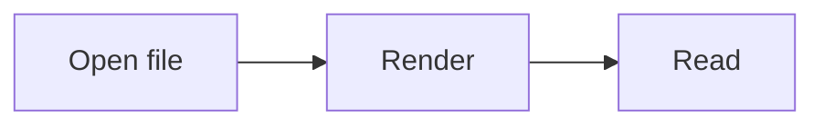

# Markedly sample

Minimal **Markdown** exercise: lists, _emphasis_, **strong**, `inline code`, and a [link](https://commonmark.org).

## Checklist

- [x] Electron shell
- [ ] Your next idea

## Table

| Feature | Status |
| ------- | ------ |
| GFM     | On     |

## Code

```ts
const greeting = "hello";
console.log(greeting);
```

## Mermaid



## Quote

> “Simple is better than complex.”

---

End.
